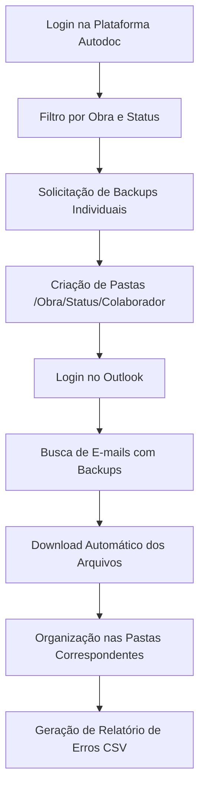

<!--
  README.md for: Automação de Backup de Colaboradores (GD4/Autodoc)
  Author: Igor (with ChatGPT assistance)
  Tip: This README mixes Markdown + a pinch of HTML for a nicer layout on GitHub.
-->

<p align="center">
  
  
  
  
</p>

<h1 align="center">🤖 Automação de Backup de Colaboradores (GD4/Autodoc)</h1>

<p align="center">
Automação ponta-a-ponta para <strong>solicitar</strong> e <strong>baixar backups de documentos</strong> de colaboradores na plataforma <strong>GD4/Autodoc</strong>, organizando tudo em pastas locais e gerando relatórios de erros.
</p>

<p align="center">
  <a href="#-fluxo-de-trabalho">Fluxo</a> •
  <a href="#-funcionalidades">Funcionalidades</a> •
  <a href="#-pré-requisitos">Pré-requisitos</a> •
  <a href="#-instalação">Instalação</a> •
  <a href="#-configuração">Configuração</a> •
  <a href="#️-execução">Execução</a> •
  <a href="#-exemplo-de-estrutura-de-pastas">Estrutura</a> •
  <a href="#-roadmap">Roadmap</a> •
</p>

---

## 🧩 Fluxo de Trabalho



---

## ✨ Funcionalidades

- ✅ Login automático no Autodoc e Outlook
- ✅ Criação de estrutura de pastas organizada (`/Obra/Status/Nome_do_Colaborador`)
- ✅ Suporte a paginação (listas longas de colaboradores)
- ✅ Solicitação individual de backup por colaborador
- ✅ Download automático via links recebidos por e-mail
- ✅ Relatório de erros em `.csv`
- ✅ Tratamento de exceções e pausas estratégicas para evitar bloqueios

---

## 🔎 Compatibilidade Rápida

<table>
  <tr>
    <th>Componente</th>
    <th>Recomendado</th>
    <th>Observações</th>
  </tr>
  <tr>
    <td>Python</td>
    <td>3.9 – 3.12</td>
    <td>Use ambiente virtual (venv)</td>
  </tr>
  <tr>
    <td>Google Chrome</td>
    <td>Última versão estável</td>
    <td>Atualize para evitar incompatibilidade</td>
  </tr>
  <tr>
    <td>ChromeDriver</td>
    <td>Compatível com seu Chrome</td>
    <td>Coloque no PATH ou na pasta do projeto</td>
  </tr>
</table>

---

## 🛠 Pré-requisitos

- <a href="https://www.python.org/downloads/">Python 3.x</a>
- <a href="https://www.google.com/chrome/">Google Chrome</a>
- <a href="https://googlechromelabs.github.io/chrome-for-testing/">ChromeDriver</a> compatível com sua versão do Chrome  
  <blockquote>
    <strong>Dica:</strong> Coloque o <code>chromedriver.exe</code> na pasta do projeto ou em uma pasta presente no <code>PATH</code> do sistema.
  </blockquote>

---

## ⚙️ Instalação

```bash
git clone https://seu-repositorio/aqui.git
cd seu-repositorio
pip install selenium
```

> Se você usar um `requirements.txt`, adicione:
>
> ```txt
> selenium>=4
> ```

---

## 🧑‍💻 Configuração

Você pode configurar de duas formas: **(A) editando o código** (mais simples) ou **(B) usando variáveis de ambiente** (mais seguro).

### A) Editando o código (simples)

#### 1) Credenciais de Acesso

No arquivo principal, edite a função `main()`:

```python
def main():
    email = "seu_email@outlook.com"      # <--- ALTERE AQUI
    senha = "sua_senha_super_secreta"    # <--- ALTERE AQUI
```

#### 2) Filtros de Backup

```python
solicitar_backup(email, senha, "Ativo", "2")  # <--- AJUSTE STATUS E OBRA (posição na lista)
```

#### 3) Caminho de Backup

```python
# Função lista_emp_status_colaborador
caminho_pasta_texto = os.path.join(r"C:\Caminho\Completo\Para\Sua\Pasta\De\Backup")

# Função clicar_email_nao_lido_outlook
lista_de_pastas = (r"C:\Caminho\Completo\Para\Sua\Pasta\De\Backup")  # Deve ser o MESMO caminho
```

<br/>

### B) Usando variáveis de ambiente (recomendado para produção)

Crie um arquivo `.env` (ou defina variáveis no seu sistema) com:

```env
EMAIL=seu_email@outlook.com
SENHA=sua_senha_super_secreta
CAMINHO_BACKUP=C:\Caminho\Completo\Para\Sua\Pasta\De\Backup
STATUS=Ativo
OBRA=2
```

No código, carregue essas variáveis com `os.getenv()` (ou `python-dotenv` se preferir):

```python
import os

EMAIL = os.getenv("EMAIL")
SENHA = os.getenv("SENHA")
CAMINHO_BACKUP = os.getenv("CAMINHO_BACKUP")
STATUS = os.getenv("STATUS", "Ativo")
OBRA = os.getenv("OBRA", "2")
```

> Exemplo de instalação do `python-dotenv` (opcional): `pip install python-dotenv`

---

## 🧭 Estrutura do Projeto (sugestão)

```
.
├── src/
│   ├── autodoc.py          # Funções de login/solicitação de backup no Autodoc
│   ├── outlook.py          # Funções de login/busca/download no Outlook
│   ├── utils.py            # Funções auxiliares (logs, salvar CSV, percorrer pastas)
│   └── main.py             # Ponto de entrada
├── README.md
├── requirements.txt
└── .env.example            # Exemplo de variáveis de ambiente
```

---

## ▶️ Execução

```bash
python nome_do_seu_script.py
```

Durante a execução:
- <strong>Janela 1</strong>: Solicitação de backups no Autodoc  
- <strong>Janela 2</strong>: Download automático dos arquivos via Outlook  

---

## 📂 Exemplo de Estrutura de Pastas

```
📂 Backup_Colaboradores
 ┣ 📂 Obra_2
 ┃ ┣ 📂 Ativo
 ┃ ┃ ┣ 📂 João_Silva
 ┃ ┃ ┃ ┗ 📄 backup_joao.zip
 ┃ ┃ ┣ 📂 Maria_Souza
 ┃ ┃ ┃ ┗ 📄 backup_maria.zip
```

---

## 🧾 Log & Relatório de Erros

- Logs são exibidos no terminal (dica: evoluir para `logging` com níveis INFO/WARNING/ERROR).
- Ao final, um arquivo `.csv` é gerado com erros (colunas recomendadas):  
  <code>timestamp, obra, status, colaborador, erro</code>.

<details>
  <summary><strong>Exemplo de saída (terminal)</strong></summary>

```
Processando a página 1 de colaboradores.
Clicou no colaborador: João Silva
Gerando backup... numero João Silva. Aguarde...
Navegando para a página 2...
Foram encontrados 2 erros. Salvando relatório...
Relatório de erros salvo com sucesso em: 'relatorio_de_erros_20250101_120301.csv'
Fechando o navegador.
```
</details>

---

## 🧪 Dicas de Confiabilidade

- Prefira `WebDriverWait` em vez de `time.sleep()` sempre que possível.
- Use seletores estáveis (`id`, `name` ou `data-*`) ao invés de XPaths muito longos.
- Centralize URLs e seletores em um único módulo para manutenção fácil.
- Garanta que o caminho de download seja absoluto e verificado antes de iniciar.

---

## 🛡️ Segurança

> ⚠️ <strong>Não</strong> commite suas credenciais!  
> Use variáveis de ambiente, `.env` (com `.gitignore`) ou um cofre de segredos.

---

## 🧭 Roadmap

- [ ] Ler configurações via `.env` por padrão
- [ ] Logging estruturado em arquivo (JSON/NDJSON)
- [ ] Paralelizar processamento por colaborador (quando seguro)
- [ ] Mecanismo de retry com backoff exponencial
- [ ] Melhorar robustez dos seletores (atributos `data-*`)
- [ ] Adicionar testes de fumaça (smoke tests) para os principais fluxos

---

## 🧐 Perguntas Frequentes (FAQ)

<details>
  <summary><strong>1) O script funciona em qualquer versão do Chrome?</strong></summary>
  Garanta que o <em>ChromeDriver</em> seja compatível com a <em>mesma versão</em> do seu Chrome.
</details>

<details>
  <summary><strong>2) O download não aparece na pasta esperada. E agora?</strong></summary>
  Verifique se o caminho configurado é absoluto e idêntico nas duas funções (criação e leitura), e se há permissões de escrita.
</details>

<details>
  <summary><strong>3) O site mudou e os seletores quebraram.</strong></summary>
  Atualize os seletores no código. Dê preferência a IDs/NAMES fixos ou atributos semânticos.
</details>

<details>
  <summary><strong>4) Posso rodar sem abrir o navegador?</strong></summary>
  É possível usar <em>headless mode</em> no Chrome, mas alguns fluxos podem exigir UI para renderizar elementos dinâmicos.
</details>

---
